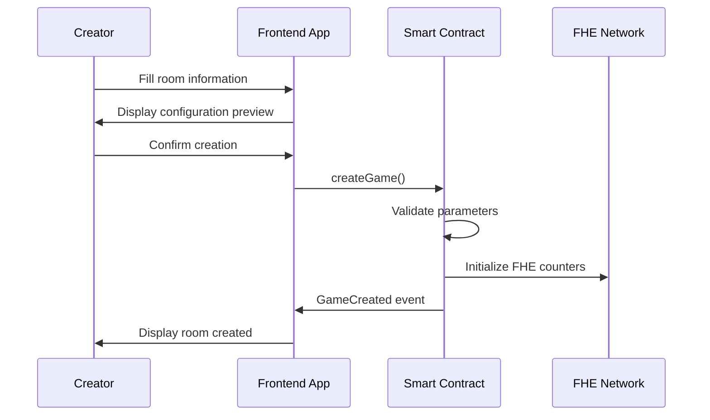
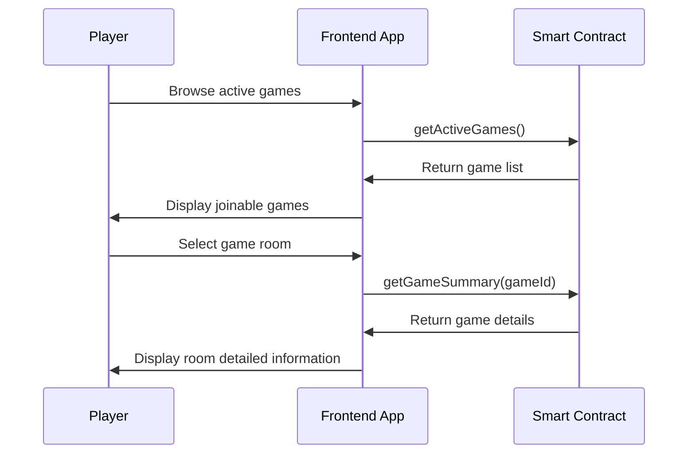
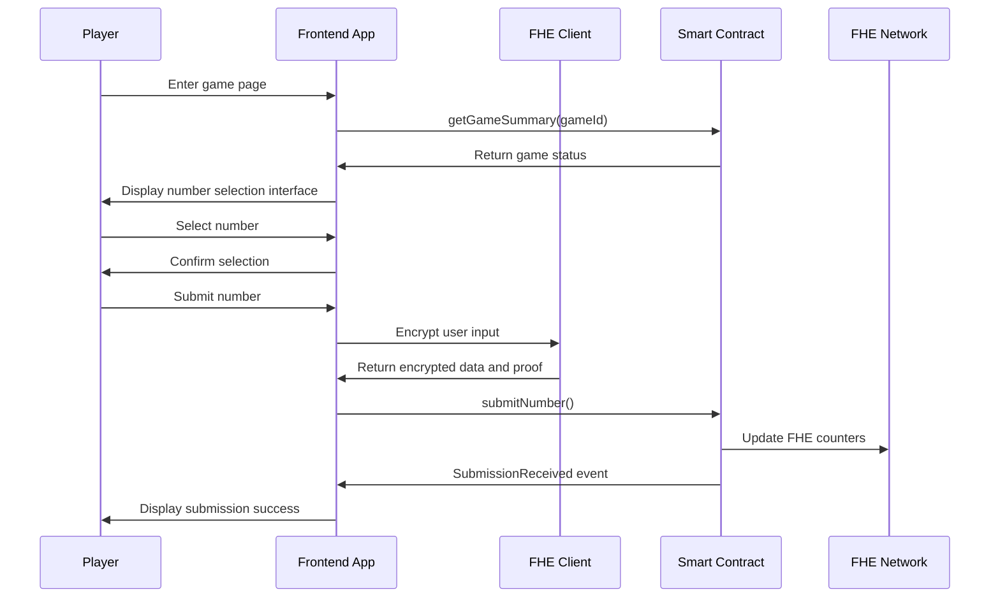
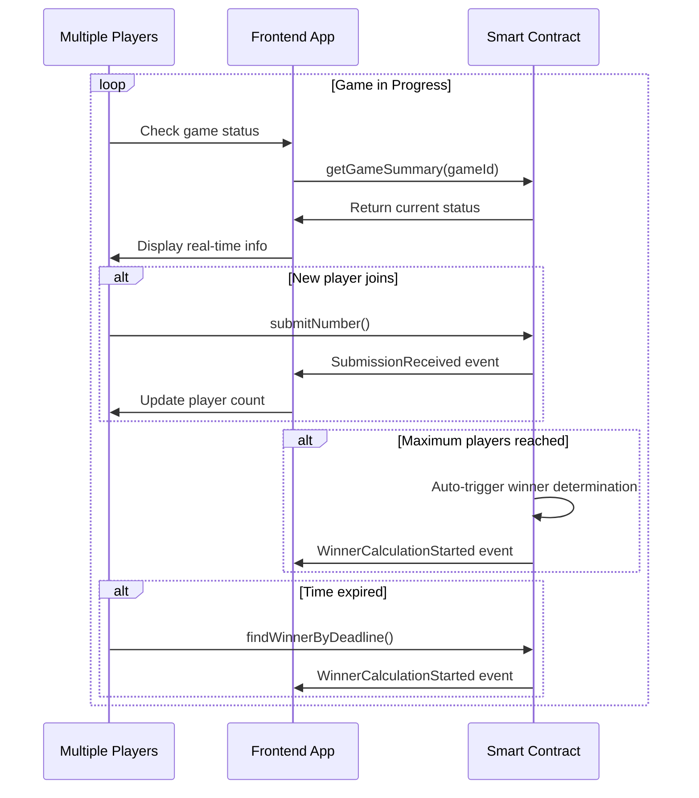
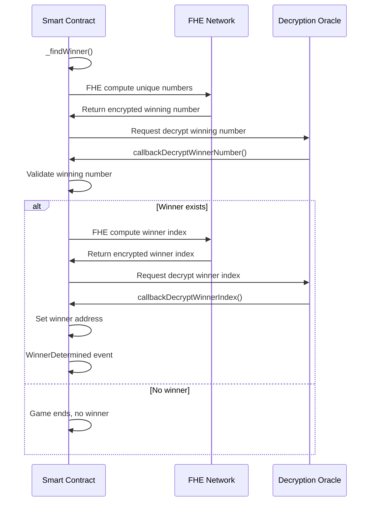
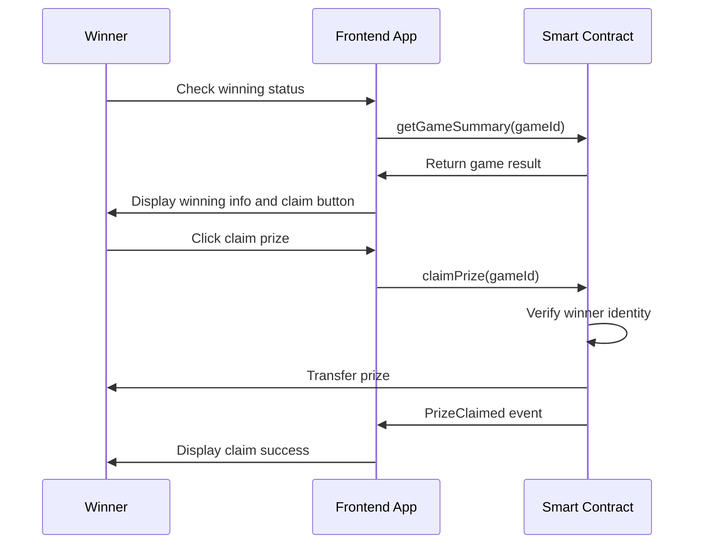

# Game Flow Documentation

This document describes the complete flow of the Number Verse Arena game, including user interactions, contract calls, and state transitions.

## 🎮 Game Overview

Number Verse Arena is a Web3 number guessing game based on FHE (Fully Homomorphic Encryption) technology. Players select numbers in an encrypted state, and players who choose **unique numbers** receive rewards.

### Core Features
- 🔐 **Privacy Protection**: Uses FHE encryption, player choices remain completely confidential until game completion
- 🏆 **Fair Competition**: All encrypted operations executed on-chain, ensuring fairness
- 💰 **Reward Mechanism**: Players who select unique numbers share the prize pool
- ⏰ **Time Limits**: Each game has clear time constraints

## 📋 Game Rules

### Basic Rules
1. **Room Creation**: Any player can create a game room
2. **Number Selection**: Players choose a number within the specified range (e.g., 1-16)
3. **Unique Wins**: Only players who select **unique numbers** (no other player selected the same) can win
4. **Prize Distribution**: If multiple winners exist, the prize pool is divided equally
5. **Time Limits**: Games have fixed participation time, automatically determining winners after timeout

### Victory Conditions
- ✅ Selected number is unique (no other player chose the same number)
- ✅ Submitted choice before deadline
- ✅ Paid correct entry fee

### Failure Conditions
- ❌ Selected number was also chosen by other players (duplicate number)
- ❌ Failed to submit before deadline
- ❌ Did not pay entry fee

## 🔄 Complete Game Flow

### Phase 1: Room Creation


**Detailed Steps:**
1. Player visits "Create Room" page
2. Fill room configuration:
   - Room name (1-64 characters)
   - Number range (e.g., 1-16)
   - Maximum players (2-10 people)
   - Entry fee (ETH)
   - Game duration (seconds)
3. Frontend validates input parameters
4. Call `createGame()` contract function
5. Contract creates game and initializes FHE counters
6. Trigger `GameCreated` event
7. Frontend displays creation success, obtain game ID

### Phase 2: Player Joining


**Detailed Steps:**
1. Player visits "Join Game" page or homepage
2. Frontend calls `getActiveGames()` to get open games
3. Display game list including:
   - Room name
   - Current players/max players
   - Entry fee
   - Remaining time
   - Number range
4. Player selects game of interest
5. Frontend calls `getGameSummary()` to get detailed information
6. Display game details for player confirmation

### Phase 3: Number Submission


**Detailed Steps:**
1. Player enters game page (via room ID)
2. Frontend gets current game status
3. Display number selection grid interface
4. Player selects a number
5. Frontend displays selection confirmation interface
6. Player confirms submission
7. **FHE Encryption Process**:
   - Frontend calls FHE library to encrypt selected number
   - Generate zero-knowledge proof
   - Prepare encrypted data and proof
8. Call `submitNumber()` contract function:
   - Pass game ID
   - Pass encrypted number
   - Pass zero-knowledge proof
   - Send entry fee
9. Contract validates and updates FHE counters
10. Trigger `SubmissionReceived` event
11. Frontend displays submission success message

### Phase 4: Game in Progress


**Detailed Steps:**
1. While game status is "Open", continuously accept new players
2. Frontend displays in real-time:
   - Current player count
   - Remaining time
   - Prize pool amount
   - Player's own selection status
3. Automatic winner determination triggers:
   - Maximum player count reached, or
   - Deadline exceeded with participants
4. Anyone can call `findWinnerByDeadline()` after time expiry

### Phase 5: Winner Calculation


**Detailed Steps:**
1. **Trigger Winner Determination**: Game status changes to "Calculating"
2. **FHE Computation Phase 1 - Find Winning Number**:
   - Iterate through all possible numbers
   - Use FHE operations to check count for each number
   - Find the smallest number with count of 1 (unique)
3. **Decryption Phase 1**: 
   - Request FHE network to decrypt winning number
   - Decryption oracle callback `callbackDecryptWinnerNumber()`
4. **FHE Computation Phase 2 - Find Winner**:
   - Iterate through all player submissions
   - Use FHE operations to find player index who selected winning number
5. **Decryption Phase 2**:
   - Request FHE network to decrypt winner index
   - Decryption oracle callback `callbackDecryptWinnerIndex()`
6. **Result Determination**:
   - Set winner address
   - Record winner history
   - Trigger `WinnerDetermined` event
   - Game status changes to "Finished"

### Phase 6: Prize Claiming


**Detailed Steps:**
1. Winner visits game page or personal stats page
2. Frontend checks if player is winner
3. Display congratulations message and "Claim Prize" button
4. Winner clicks claim prize
5. Call `claimPrize()` contract function
6. Contract verification:
   - Game status is "Finished"
   - Caller is the winner
   - Prize pool has balance
7. Transfer prize to winner's wallet
8. Trigger `PrizeClaimed` event
9. Game status changes to "PrizeClaimed"
10. Frontend displays claim success message

## 🎯 User Interface Flow

### Homepage Flow
```
Homepage → Display active games list
    ├── Create Room → Create room page
    ├── Join Game → Game selection page
    └── View Leaderboard → Leaderboard page
```

### Create Room Flow
```
Create Room Page
├── Select preset configuration (quick start)
├── Custom configuration
│   ├── Room name
│   ├── Player count
│   ├── Number range  
│   ├── Entry fee
│   └── Game duration
├── Preview configuration
└── Confirm creation → Game page
```

### Game Page Flow
```
Game Page
├── Display game info (room name, participants, time, prize pool)
├── Number selection grid
├── Player status panel
├── Select number → Confirm submission → Wait for result
└── Game ends
    ├── Victory → Claim prize
    └── Loss → View result analysis
```

## 📊 State Management

### Game States
- **Open** (0): Game open, accepting players
- **Calculating** (1): Calculating winner, no new players accepted
- **Finished** (2): Game ended, winner can claim prize
- **PrizeClaimed** (3): Prize has been claimed

### Frontend States
- **Loading**: Data loading
- **Connected**: Wallet connected
- **Selecting**: Player selecting number
- **Confirming**: Transaction confirming
- **Submitted**: Submitted, waiting for result
- **Won**: Player won
- **Lost**: Player lost

## ⚠️ Exception Handling

### Contract Level
1. **No Participants**: Game ends, no winner, entry fees not refunded (by rules)
2. **No Unique Numbers**: All numbers selected by multiple players, no winner
3. **Decryption Failure**: Retry mechanism, final fallback to game cancellation
4. **Insufficient Gas**: Transaction fails, user needs to retry

### Frontend Level
1. **Network Disconnect**: Display offline prompt, auto-reconnect
2. **Wallet Disconnect**: Prompt to reconnect wallet
3. **Transaction Failure**: Display specific error message and retry options
4. **Time Synchronization**: Periodically sync block time, avoid time drift

### User Experience
1. **Error Recovery**: Provide clear error messages and solutions
2. **State Preservation**: Restore user state after page refresh
3. **Progress Indication**: Clearly show current phase and remaining steps
4. **Help System**: Provide game rules explanation and FAQ

## 🔐 Security Considerations

### Privacy Protection
- Player selections encrypted through FHE, not visible on-chain
- Winning number only revealed after game completion
- Winner identity determined through FHE computation

### Fairness Guarantee
- All encryption operations executed on-chain
- Cannot know other players' selections in advance
- Decryption process verified through oracle

### Economic Security
- Entry fees locked in contract
- Only verified winners can claim prizes
- Reentrancy attack protection

## 📈 Performance Optimization

### On-Chain Optimization
- FHE operations batched processing
- Event-driven state updates
- Gas usage optimization

### Frontend Optimization
- Data caching and preloading
- Real-time status subscription
- Reactive UI updates

---

This game flow ensures smooth user experience while maintaining the privacy protection features provided by FHE technology. Each phase has clear state transitions and error handling mechanisms.