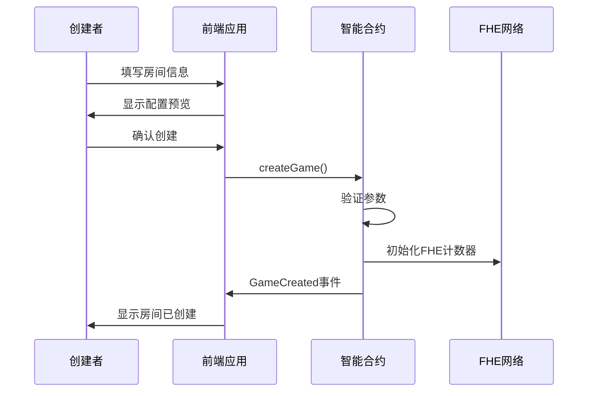
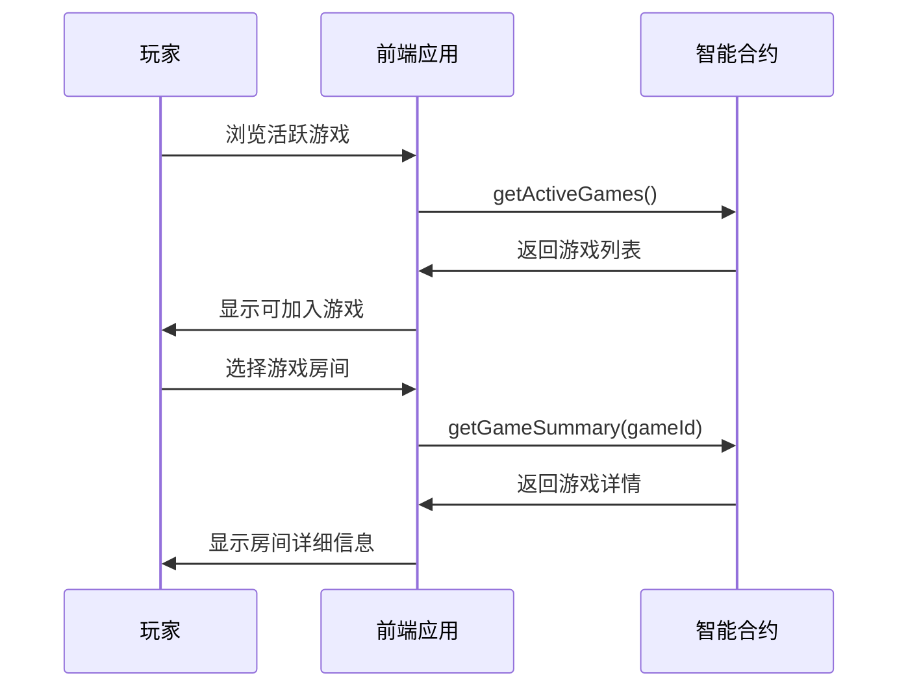
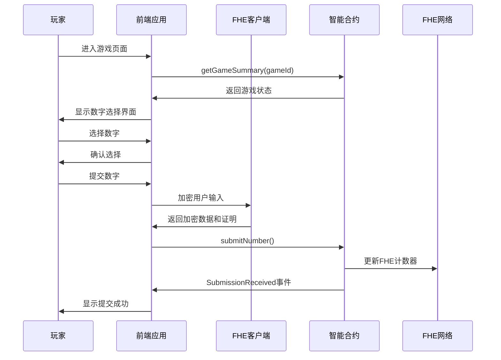
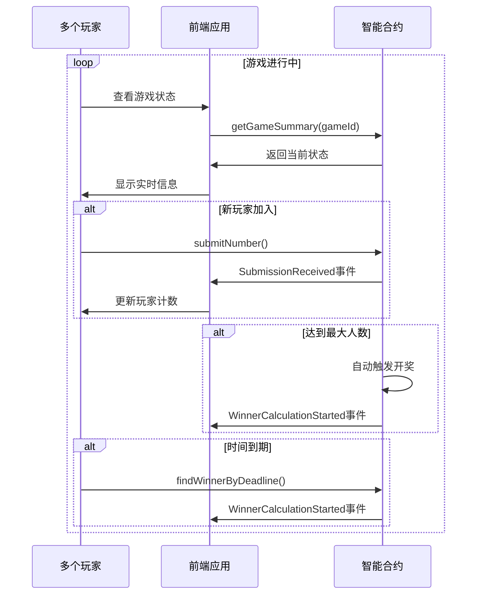
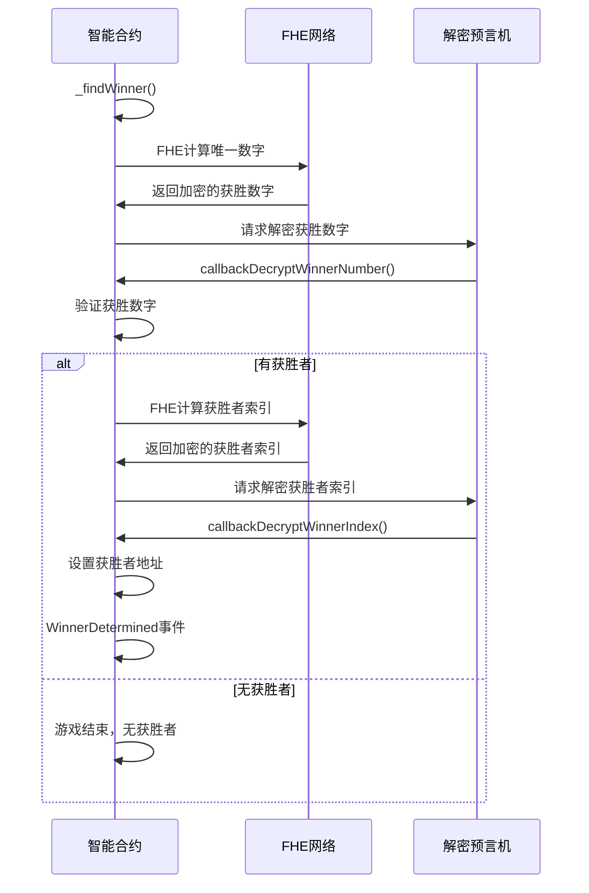
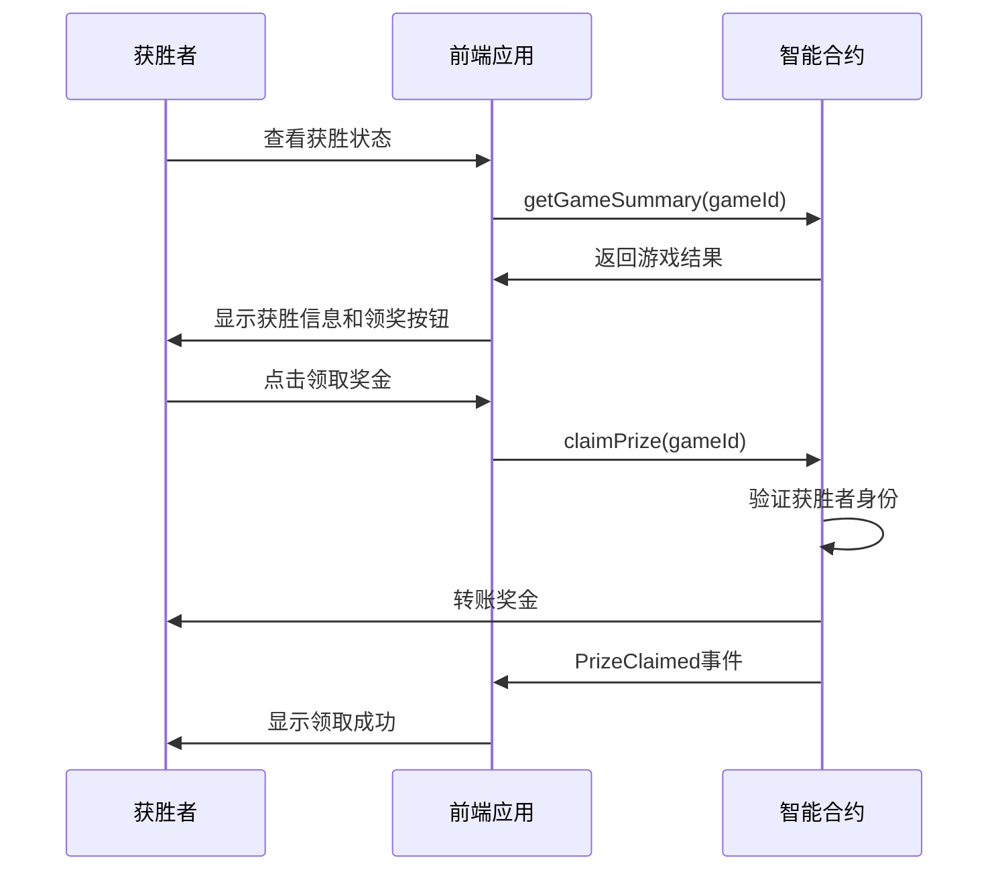

# 游戏流程说明

本文档详细描述Number Verse Arena游戏的完整流程，包括用户交互、合约调用和状态变化。

## 🎮 游戏概述

Number Verse Arena是一个基于FHE（完全同态加密）技术的Web3数字猜测游戏。玩家在加密状态下选择数字，选择**唯一数字**的玩家获得奖励。

### 核心特性
- 🔐 **隐私保护**: 使用FHE加密，玩家选择在游戏结束前完全保密
- 🏆 **公平竞争**: 所有加密操作在链上执行，确保公平性
- 💰 **奖励机制**: 选择唯一数字的玩家平分奖池
- ⏰ **时间限制**: 每局游戏有明确的时间限制

## 📋 游戏规则

### 基本规则
1. **房间创建**: 任何玩家都可以创建游戏房间
2. **数字选择**: 玩家在指定范围内选择一个数字（例如1-16）
3. **唯一获胜**: 只有选择**唯一数字**（没有其他玩家选择）的玩家才能获胜
4. **奖池分配**: 如有多个获胜者，奖池将平均分配
5. **时间限制**: 游戏有固定的参与时间，超时后自动开奖

### 获胜条件
- ✅ 选择的数字是唯一的（没有其他玩家选择相同数字）
- ✅ 在截止时间前提交选择
- ✅ 支付正确的参与费用

### 失败条件
- ❌ 选择的数字有其他玩家也选择（重复数字）
- ❌ 超过截止时间未提交
- ❌ 未支付参与费用

## 🔄 完整游戏流程

### 阶段1: 房间创建


**详细步骤:**
1. 玩家访问"创建房间"页面
2. 填写房间配置:
   - 房间名称 (1-64字符)
   - 数字范围 (例如: 1-16)
   - 最大玩家数 (2-10人)
   - 参与费用 (ETH)
   - 游戏时长 (秒)
3. 前端验证输入参数
4. 调用 `createGame()` 合约函数
5. 合约创建游戏并初始化FHE计数器
6. 触发 `GameCreated` 事件
7. 前端显示创建成功，获得游戏ID

### 阶段2: 玩家加入


**详细步骤:**
1. 玩家访问"加入游戏"页面或主页
2. 前端调用 `getActiveGames()` 获取开放游戏
3. 显示游戏列表，包含:
   - 房间名称
   - 当前玩家数/最大玩家数
   - 参与费用
   - 剩余时间
   - 数字范围
4. 玩家选择感兴趣的游戏
5. 前端调用 `getGameSummary()` 获取详细信息
6. 显示游戏详情供玩家确认

### 阶段3: 数字提交


**详细步骤:**
1. 玩家进入游戏页面（通过房间ID）
2. 前端获取游戏当前状态
3. 显示数字选择网格界面
4. 玩家选择一个数字
5. 前端显示选择确认界面
6. 玩家确认提交
7. **FHE加密过程**:
   - 前端调用FHE库加密选择的数字
   - 生成零知识证明
   - 准备加密数据和证明
8. 调用 `submitNumber()` 合约函数:
   - 传入游戏ID
   - 传入加密的数字
   - 传入零知识证明
   - 发送参与费用
9. 合约验证并更新FHE计数器
10. 触发 `SubmissionReceived` 事件
11. 前端显示提交成功消息

### 阶段4: 游戏进行中


**详细步骤:**
1. 游戏状态为"Open"时，持续接受新玩家
2. 前端实时显示:
   - 当前玩家数量
   - 剩余时间
   - 奖池金额
   - 玩家自己的选择状态
3. 自动开奖触发条件:
   - 达到最大玩家数量，或
   - 超过截止时间且有参与者
4. 任何人都可以在时间到期后调用 `findWinnerByDeadline()`

### 阶段5: 开奖计算


**详细步骤:**
1. **触发开奖**: 游戏状态变为"Calculating"
2. **FHE计算阶段1 - 找到获胜数字**:
   - 遍历所有可能的数字
   - 使用FHE操作检查每个数字的计数
   - 找到计数为1（唯一）且最小的数字
3. **解密阶段1**: 
   - 请求FHE网络解密获胜数字
   - 解密预言机回调 `callbackDecryptWinnerNumber()`
4. **FHE计算阶段2 - 找到获胜者**:
   - 遍历所有玩家的提交
   - 使用FHE操作找到选择了获胜数字的玩家索引
5. **解密阶段2**:
   - 请求FHE网络解密获胜者索引
   - 解密预言机回调 `callbackDecryptWinnerIndex()`
6. **结果确定**:
   - 设置获胜者地址
   - 记录获胜历史
   - 触发 `WinnerDetermined` 事件
   - 游戏状态变为"Finished"

### 阶段6: 奖金领取


**详细步骤:**
1. 获胜者访问游戏页面或个人统计页面
2. 前端检查玩家是否为获胜者
3. 显示获胜恭喜信息和"领取奖金"按钮
4. 获胜者点击领取奖金
5. 调用 `claimPrize()` 合约函数
6. 合约验证:
   - 游戏状态为"Finished"
   - 调用者是获胜者
   - 奖池有余额
7. 转账奖金到获胜者钱包
8. 触发 `PrizeClaimed` 事件
9. 游戏状态变为"PrizeClaimed"
10. 前端显示领取成功消息

## 🎯 用户界面流程

### 主页流程
```
主页 → 显示活跃游戏列表
    ├── 创建房间 → 创建房间页面
    ├── 加入游戏 → 游戏选择页面
    └── 查看排行榜 → 排行榜页面
```

### 创建房间流程
```
创建房间页面
├── 选择预设配置 (快速开始)
├── 自定义配置
│   ├── 房间名称
│   ├── 玩家数量
│   ├── 数字范围  
│   ├── 参与费用
│   └── 游戏时长
├── 预览配置
└── 确认创建 → 游戏页面
```

### 游戏页面流程
```
游戏页面
├── 显示游戏信息 (房间名、参与者、时间、奖池)
├── 数字选择网格
├── 玩家状态面板
├── 选择数字 → 确认提交 → 等待结果
└── 游戏结束
    ├── 获胜 → 领取奖金
    └── 失败 → 查看结果分析
```

## 📊 状态管理

### 游戏状态
- **Open** (0): 游戏开放，接受玩家加入
- **Calculating** (1): 正在计算获胜者，不接受新玩家
- **Finished** (2): 游戏结束，获胜者可领奖
- **PrizeClaimed** (3): 奖金已被领取

### 前端状态
- **Loading**: 数据加载中
- **Connected**: 钱包已连接
- **Selecting**: 玩家正在选择数字
- **Confirming**: 交易确认中
- **Submitted**: 已提交，等待结果
- **Won**: 玩家获胜
- **Lost**: 玩家失败

## ⚠️ 异常情况处理

### 合约层面
1. **无人参与**: 游戏结束，无获胜者，参与费用不退还（按规则）
2. **无唯一数字**: 所有数字都被多人选择，无获胜者
3. **解密失败**: 重试机制，最终fallback到游戏取消
4. **Gas不足**: 交易失败，用户需要重试

### 前端层面
1. **网络断开**: 显示离线提示，自动重连
2. **钱包断开**: 提示重新连接钱包
3. **交易失败**: 显示具体错误信息和重试选项
4. **时间同步**: 定期同步区块时间，避免时间偏差

### 用户体验
1. **错误恢复**: 提供明确的错误信息和解决方案
2. **状态保存**: 在页面刷新后恢复用户状态
3. **进度指示**: 清楚显示当前阶段和剩余步骤
4. **帮助系统**: 提供游戏规则说明和FAQ

## 🔐 安全考虑

### 隐私保护
- 玩家选择通过FHE加密，链上不可见
- 只有游戏结束后才公开获胜数字
- 获胜者身份通过FHE计算确定

### 公平性保证
- 所有加密操作在链上执行
- 无法提前知道其他玩家选择
- 解密过程通过预言机验证

### 经济安全
- 参与费用锁定在合约中
- 只有验证的获胜者可以领取奖金
- 防重入攻击保护

## 📈 性能优化

### 链上优化
- FHE操作批量处理
- 事件驱动的状态更新
- Gas使用优化

### 前端优化
- 数据缓存和预加载
- 实时状态订阅
- 响应式UI更新

---

这个游戏流程确保了用户体验的流畅性，同时维护了FHE技术提供的隐私保护特性。每个阶段都有明确的状态转换和错误处理机制。